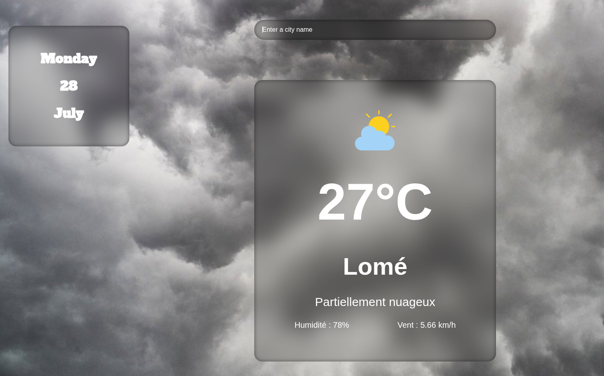

# ☀️Weather App

Aperçu
Cette application météo simple affiche les conditions météorologiques actuelles pour une ville spécifiée. Elle montre la température, la description météo, l'humidité et la vitesse du vent.

## 🚀Fonctionnalités
- Affichage de la température actuelle (exemple : 27°C)
- Description des conditions météo ("Partiellement nuageux")
- Indicateur d'humidité (exemple : 78%)
- Vitesse du vent (exemple : 5,66 km/h)
- Interface épurée et minimaliste
- Affichage de la date (exemple : Lundi 28 Juillet)



## 🛠️ Technologies utilisées

- HTML5
- CSS3 (avec effets de flou, dégradés et ombres)
- JavaScript

## 🌦Utilisation
1. Entrez le nom d'une ville dans le champ de saisie.
2. Consultez les conditions météo actuelles pour cette localisation.

## 📦Installation
1. Clone le dépôt :
   ```bash
   git clone https://github.com/nicostar-lab/weather_app.git

🤝 Contribution
Les contributions sont les bienvenues !
N'hésitez pas à forker le projet, proposer des améliorations ou signaler des bugs.

Auteur : [nicostar-lab](https://github.com/nicostar-lab)


